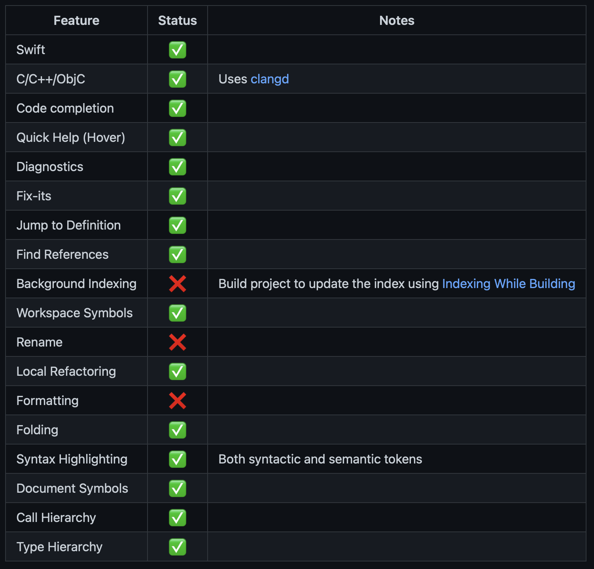
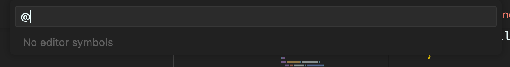
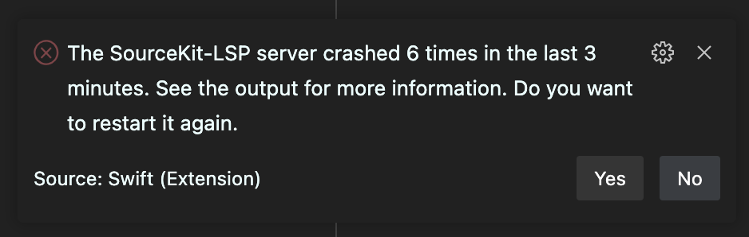

build-lists: true
autoscale: true
footer: © Marcelo Esperidiao @marcelo@mastodon.au
slidenumbers: true

[.footer: ]
[.slidenumbers: false]

# Swift in VS Code

### Marcelo Esperidiao

---

# Alternative Titles

* You Won't Believe What Swift in VS Code Looks Like Now! See Jaw-Dropping Transformation in Next Slides!
* Earn $10,000 Per Month Working from Home! This Developer Discovered How - Watch to Find Out!
* 10 Shocking Facts about Swift in VS Code That Will Blow Your Mind! Number 6 Will Leave You Speechless!

# GitHub Integration

- Comment on a PR
- Type `.` to Code

---

# Annoyances

* SourceKit-LSP is not feature-complete
  * No background indexing means compilation has to complete in order to index
  * No renaming
  * No formatting
    * Swift-Format was designed to work with SourceKit-LSP

---

<!-- 
 -->
